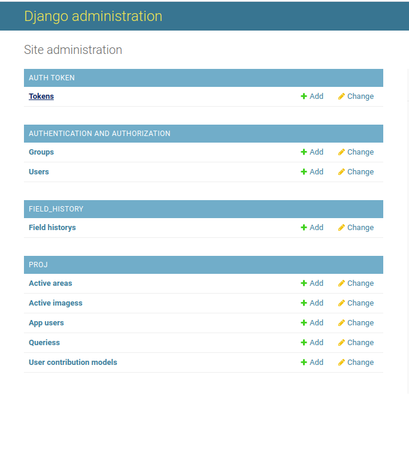
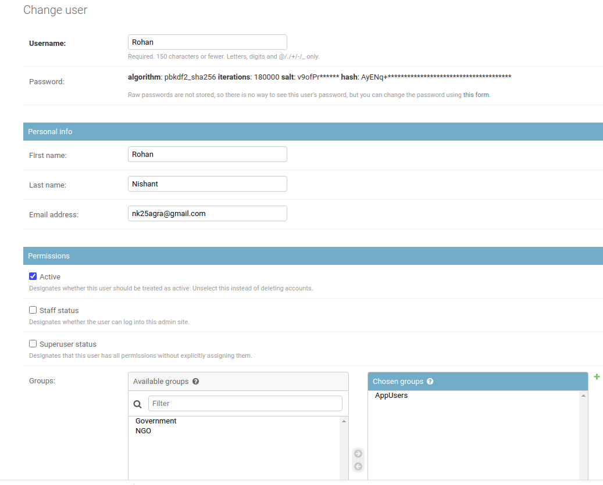
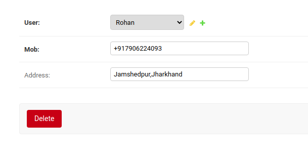
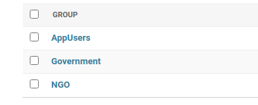
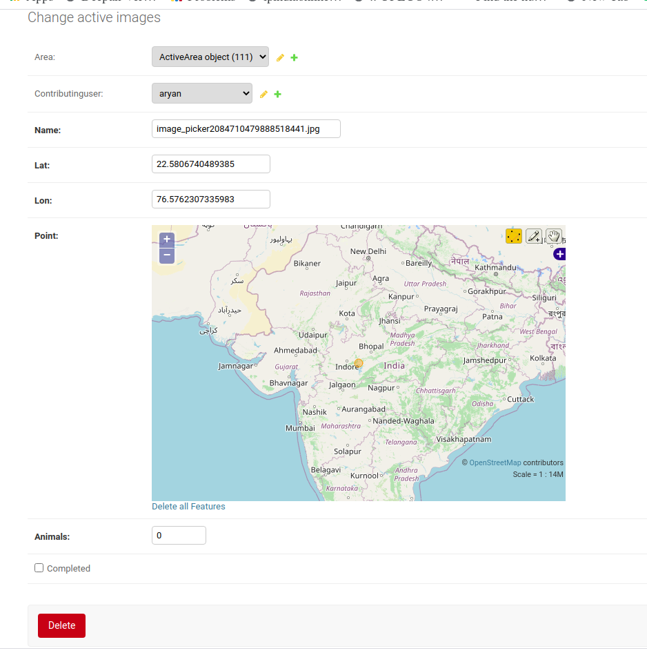
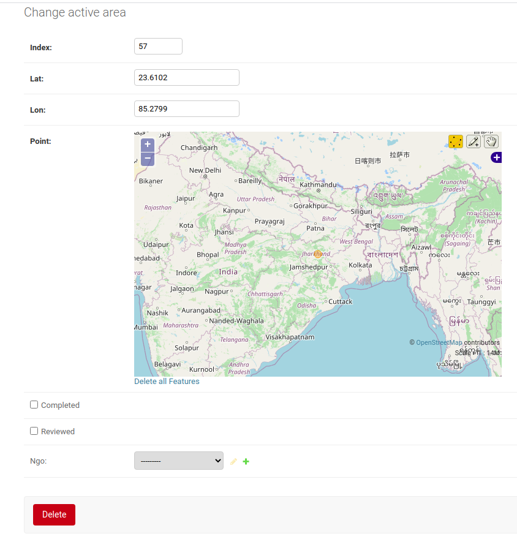
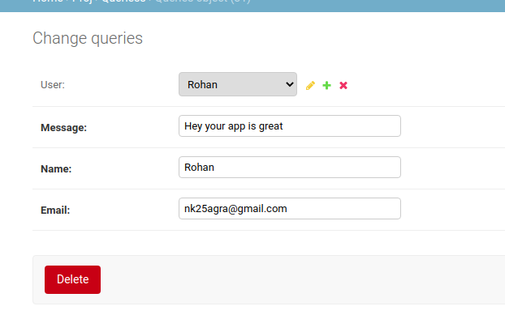

# Why me migrated from Sqlite3 to PostgreSQL
As mentioned in our solution we are finding Nearest Uncleaned Areas to all NGOs as these queries would be real time we require something efficient so we thought of using some Spatial Database   
    
A spatial database is a database that is optimized for storing and querying data that represents objects defined in a geometric space. Most spatial databases allow the representation of simple geometric objects such as points, lines and polygons. Some spatial databases handle more complex structures such as 3D objects, topological coverages, linear networks, and TINs. While typical databases have developed to manage various numeric and character types of data, such databases require additional functionality to process spatial data types efficiently, and developers have often added geometry or feature data types.    
     
      
Spatial Databases Store data in form of R-tree unlike regular databases which store data in B-Tree ,due to this reason they provide very fast location queries   
**PostGIS** provides spatial objects for the PostgreSQL database, allowing storage and query of information about location and mapping. beside that PostgreSQL has many advantages over Sqlite3 database for such a large project
     
 You can find code using PostgreSQL database in different branch
 
 # What about Security?
 
 So here is a list of few things that we looked into while designing our Backend with django which provides some of these by default
* Cross site Scripting (XSS Protection)
* Cross Site Forgery protection (CSRF Protection)
* SQL Injection protection
* ClickJacking Protection
* SSL(HTTPS) - for secure connection between server and clients
* Secure Session Cookies
* Safe Password Hashing(PBKDF2 Hashing Algorithm)    
     
It's also important to note, that Django is implemented in Python, which has excellent security track record. Thus the underlying language is not a security risk.

# Database
### Here is how our db admin looks like   

### Some Other DB Tables    
     
#### User
 
    

#### Extended User
      
    
#### Groups
      
    
#### Active Images
      
    
#### Active Areas
      
    
#### Queries
      
   

