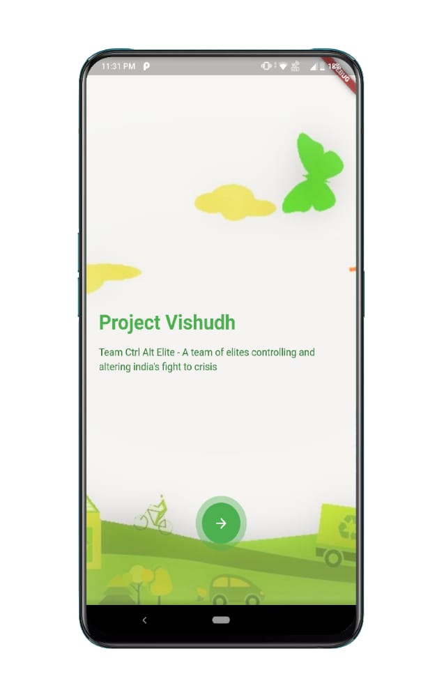
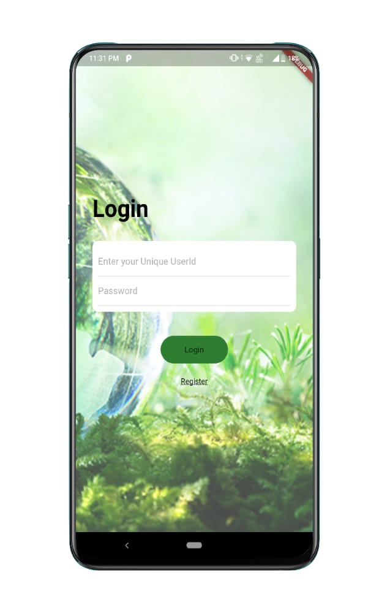
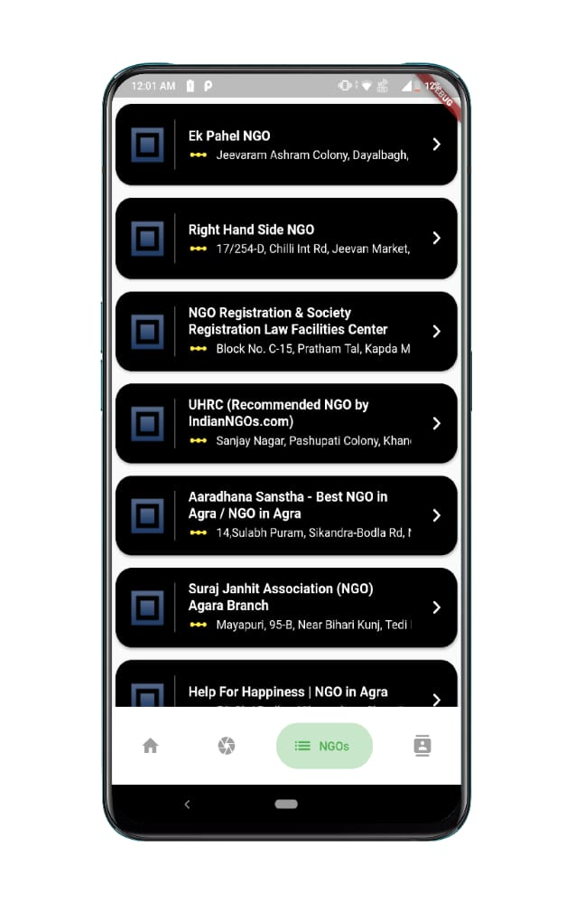
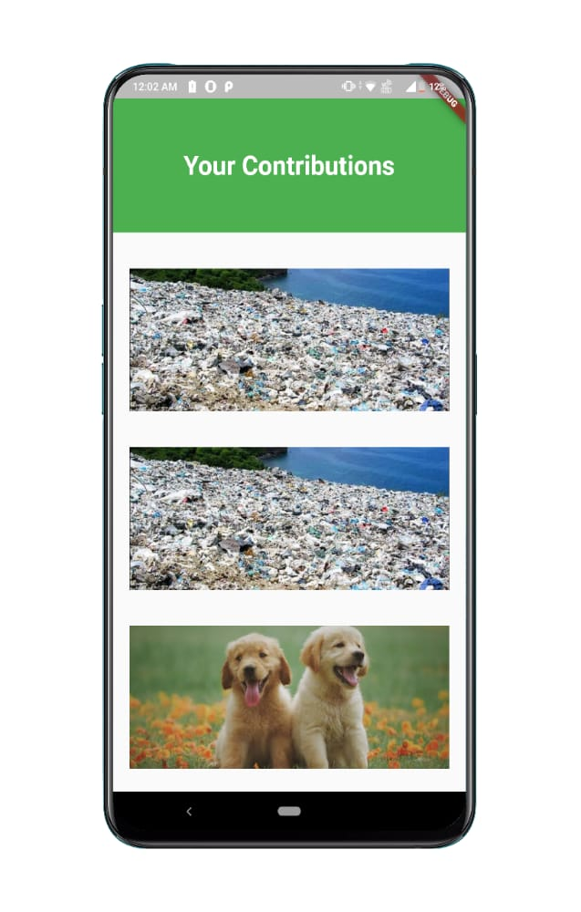
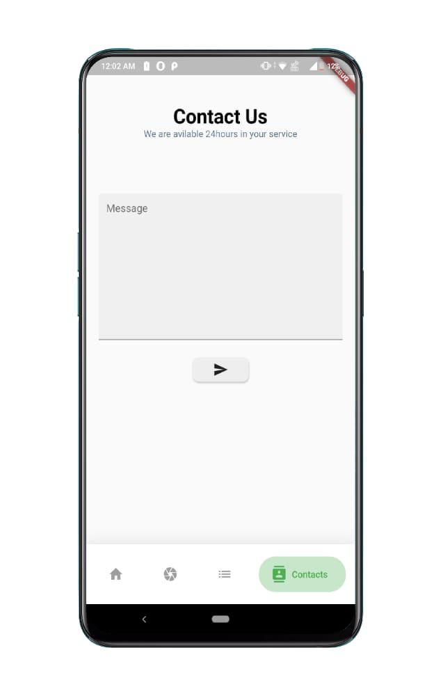

# Project Visudh
> Tacking India'a Waste Problem

[![NPM Version][npm-image]][npm-url]
[![Build Status][travis-image]][travis-url]
[![Downloads Stats][npm-downloads]][npm-url]

## Project Description
There are quite a lot of unnoticed waste in our country. Our main aim is to bring that waste to notice using drone and vehicular surveillance and even general public’s intervention.   
The drone and vehicular cameras captures videos along with location, date and time and directly sends it to our main server.  
  From these video, around 30 frames per minute will be captured. 
The interested people can capture the image of waste in their nearby loacality.   
Convolutional Neural Network (CNN) will be used to detect whether the image contains garbage or not.   
We are also generating Index which will tell us the urgency to clean that area based on various factors like
* Amount of Garbage
* Water Bodies in that Area
* Population Density
* Number of Animals

So that the area which needs higher attention can be brought into notice, all this is shown on Heat Map in different shades using Google Maps API

## 📸ScreenShots

| 1 | 2|
|------|-------|
|||

| 3 | 4|
|------|-------|
|||

| 5 | 6 |
|------|-------|
|||

> The App Allows users to click a pic on uncleaned area nearby and send it to server the server checks for Garbage in Image and if found  
User get a +1 Contribution Point 
The App Also Allows user to view Nearby NGO Registered as well as non registered and also contact us in case of any problem he/she is facing

Add Website ScreenShots here

## Implementation

This is how the database schema looks like for now   
For Now We have same User Model for Users,NGOs and Government with
different permission for everyone by seperating them with different group   
But We are ready to seperate it in future if the demand arrives  

ML Model Implementation

### So How Everything Works
So everything starts when we get Images at server either from Drones or Users using our app 
Our ML Model checks for garbage in Image and if garbage is found it saves image in Database
We run a script daily on our database to group images in similar area and if image belongs to some area which is already active it is assigned to that area   
Whenever a new garbage image is added to an area its garbage index is recalculated and saved

All NGOs can see these area in order of their garbage Index any NGO can take an area under review , After an NGO take an area under review it gets a responsibilty to clean that area as fast as possible to Increase its Work Done so that Government could increase its rating

Here is when Goverement role comes into play , Government could see all those areas whose request for cleaning is given atleast 15 days ago and are still uncleaned and if taken under review by some NGO and not cleaned in 15 days government can also see name of NGO 
whose under review a particular area is  

Governement can increase or decrease rating of any NGO based on their work done or activeness , government can also permanently delete or ban NGO in case of false remark by NGO of work completion

Anyone can see NGOs profile to see their previous works in cleaning India and rating assigned to them by government

## Future Scope

## Deployment

Our server is deployed with amazon EC2 

You are free to check it out
[Link]()

Also have a look at our app
[Link]()

## Build With

* Python
* Keras
* TensorFlow
* OpenCV
* Flutter
* Django
* Google Maps API
* HTML5
* SCSS(CSS) 
* JavaScript(jQuery)

## Authors

[Aryan Khandelwal]()   
[Abhilasha Sinha]()  
[Amit Dutta]()  
[Rohan Nishant]()    
[Rashi Gupta]()    
[Shrey Rai]()  

## Contributing

1. Fork it (<https://github.com/yourname/yourproject/fork>)
2. Create your feature branch (`git checkout -b feature/fooBar`)
3. Commit your changes (`git commit -am 'Add some fooBar'`)
4. Push to the branch (`git push origin feature/fooBar`)
5. Create a new Pull Request

<!-- Markdown link & img dfn's -->
[npm-image]: https://img.shields.io/npm/v/datadog-metrics.svg?style=flat-square
[npm-url]: https://npmjs.org/package/datadog-metrics
[npm-downloads]: https://img.shields.io/npm/dm/datadog-metrics.svg?style=flat-square
[travis-image]: https://img.shields.io/travis/dbader/node-datadog-metrics/master.svg?style=flat-square
[travis-url]: https://travis-ci.org/dbader/node-datadog-metrics
[wiki]: https://github.com/yourname/yourproject/wiki
