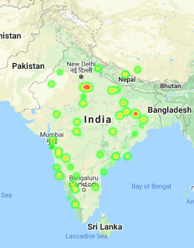

# Project Visudh
> Tacking India'a Waste Problem

    

## Project Description

There are quite a lot of unnoticed waste in our country. Our main aim is to bring that waste to notice using drone and vehicular surveillance and even general public’s intervention following the footsteps of **"Swachh Bharat Abhiyan"**.    
The drone and vehicular cameras captures videos along with location, date and time and directly send it to our main server. The interested people can also capture the image of waste in their nearby loacality using our app.

**Deep learning** techniques are used to detect whether the image contains garbage or not and also the animals present around the garbage. **Clusters** are defined with each cluster having a radius of around **1km**. Using API calls population density and number of water bodies is fetched for all the clusters. Thus with this we have these four features for every cluster:

* **Number of garbage locations**
* **Water Bodies**
* **Population Density**
* **Number of Animals**

Using these four features a **Garbage Index** is generated and the clusters are divided into three types each with **high, medium or low urgency**. These index are plotted on the map and the ngos are notified about it through our website. NGOs undertake these areas for cleaning, and once they clean it the governement reviews the cleaned area and updates ratings of NGOs based on their performance. If there are certain areas which none of the NGOs have cleaned for a very long time the government can get it cleaned. Thus, with the involvement of the citizens, the NGOs and the governement we aim to make our country more clean.

## 📸ScreenShots

| 1 | 2|
|------|-------|
|||

| 3 | 4|
|------|-------|
|||

| 5 | 6 |
|------|-------|
|||

> The App Allows users to click a pic on uncleaned area nearby and send it to server the server checks for Garbage in Image and if found  
User get a +1 Contribution Point 
The App Also Allows user to view Nearby NGO Registered as well as non registered and also contact us in case of any problem he/she is facing

Add Website ScreenShots here

## Implementation

This is how the database schema looks like for now   
For Now We have same User Model for Users,NGOs and Government with
different permission for everyone by seperating them with different group   
But We are ready to seperate it in future if the demand arrives  

## ML Model Implementation

### Garbage Detection
### Data Set 
There are two sources of our dataset.
1. **Open source garbage in image dataset**
2. **Dataset collected by us from our nearby areas.**

**Augmentation** - One of the major aspects while capturing a video or an image is the lighting effect depending on the weather (if its sunny or cloudy) drones might capture images with varied brightness. So bightness of the image is the main thing tthat we have considered while augmentation.

After collecting the dataset we constructed bounding boxes around them and labelled them manually using this tool - https://github.com/tzutalin/labelImg

Then we used transfer learning to train our model on ssd_mobilenet_version1. We have also quantized our model to make it light weigth so that the processing time of images is reduced. For image detection its 10fps on cpu and 20fps on gpu.

### Animal Detection

We have used pretrained YOLO model for detecting animals

### Water Body
 We are using google maps API to get the water bodies within a given radius.
 
 ### Population
 For now we are using reverse geocoding to get the city/town from a latitude and longitude and again an API call for finding the polulation density of that area. If the governement gives us the latest census data of India we can use that to get better results.
 
 ### Generating Index
 All the above values are integers, so we are normalizing them in the range 0 to 1 and assigning weights to each feature and finding the index on the end which lies in the range 0 to 10, which are divided in three zones **red, yellow and green**. (high to low urgency) 
 

### So How Everything Works
So everything starts when we get Images at server either from Drones or Users using our app 
Our ML Model checks for garbage in Image and if garbage is found it saves image in Database
We run a script daily on our database to group images in similar area and if image belongs to some area which is already active it is assigned to that area   
Whenever a new garbage image is added to an area its garbage index is recalculated and saved

All NGOs can see these area in order of their garbage Index any NGO can take an area under review , After an NGO take an area under review it gets a responsibilty to clean that area as fast as possible to Increase its Work Done so that Government could increase its rating

Here is when Goverement role comes into play , Government could see all those areas whose request for cleaning is given atleast 15 days ago and are still uncleaned and if taken under review by some NGO and not cleaned in 15 days government can also see name of NGO 
whose under review a particular area is  

Governement can increase or decrease rating of any NGO based on their work done or activeness , government can also permanently delete or ban NGO in case of false remark by NGO of work completion

Anyone can see NGOs profile to see their previous works in cleaning India and rating assigned to them by government

Here is the image of heat map which is live on our website   
     
</img>
## Future Scope

Presently our website is deployed on  AWS but it can comfortably be hosted on NICSI Cloud service of the Government in accordance with the data localization policy

Vehicular Cameras will be deployed for image collection for cost reduction and greater efficency.

## Deployment

Our server is deployed with amazon EC2 

Our Website is live [here](https://ctrlaltelite.cf/)

Also have a look at our app
[Link](https://drive.google.com/file/d/1DHeHex3gOKreIHktdvxPrblJhKDmaI67/view?usp=drivesdk)

## Build With

* Python  
* Keras  
* TensorFlow  
* OpenCV  
* Flutter  
* Django  
* Google Maps API  
* HTML5  
* SCSS(CSS)  
* JavaScript(jQuery)  

## Authors

[Aryan Khandelwal](https://github.com/aryan29)   
[Abhilasha Sinha](https://github.com/Abhilasha06)  
[Amit Dutta](https://github.com/Amitdutta7)    
[Rohan Nishant](https://github.com/rondon1947)    
[Rashi Gupta](https://github.com/rashigupta37)    
[Shrey Rai](https://github.com/shreyrai99)  

